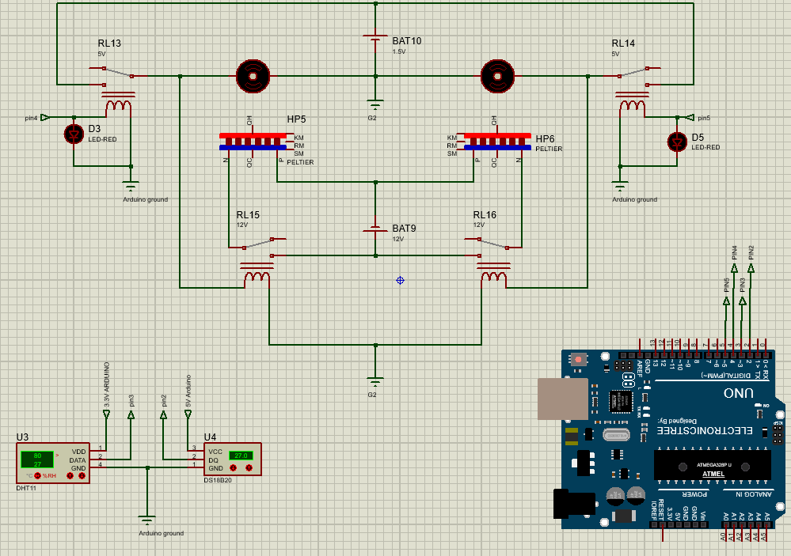

<div align="center">
  <a href="https://instagram.com/sy_saeed.m">
    
  </a>
</div>


# Incubator for Plasma Bio Research
<div align="center">

</div>


## What is this project?
This project is a **temperature and humidity-controlled incubator** designed for **plasma bio research**. It is used to study the effect of **atmospheric pressure plasma jet (APPJ)** on biological samples in a **controlled environment**. The incubator is powered by **Arduino** and controlled using **LabVIEW**, allowing precise regulation of **temperature and humidity**. Additionally, a **CNC system** is integrated for fine adjustments and automation.

## Features
- **Temperature & Humidity Control**: Maintains a stable environment for experiments.
- **LabVIEW & Arduino Integration**: Ensures precise real-time control and monitoring.
- **CNC System**: Allows automated positioning and adjustments.
- **Data Logging**: Collects experimental data for further analysis.
- **Plasma Treatment Compatibility**: Designed specifically for plasma-based biological research.

## How to Use?
### 1. Clone the Repository
```bash
git clone https://github.com/Saeed9731/Plasma_Incubator.git
cd Plasma_Incubator
```

### 2. Upload the Arduino Code
- Open **Arduino IDE** and upload the `HeatWave.ino` file to your **Arduino board**.
- Ensure all sensors and actuators are correctly connected.

### 3. Run LabVIEW Interface
- Open the **LabVIEW project file**.
- Start the control panel to monitor and regulate temperature & humidity.

### 4. CNC System Setup (if applicable)
- Ensure the CNC system is properly calibrated.
- Run the provided G-code files for automated adjustments.

## Requirements
- **Arduino Board** (e.g., Arduino Mega)
- **Temperature & Humidity Sensors** (e.g., DS18B20, DHT22)
- **Heating & Cooling System** (e.g., Peltier module, fan, heater)
- **LabVIEW Software**
- **CNC Controller (if used)**

## Contributions
Contributions are welcome! Feel free to submit pull requests or report issues in the repository.

<div align="center">

</div>

## Stay Updated
If you want to get notified about future updates, **Follow my GitHub account** and check my Instagram:
[**@sy_saeed.m**](https://instagram.com/sy_saeed.m)

---
Developed with ❤️ by **Saeed**

